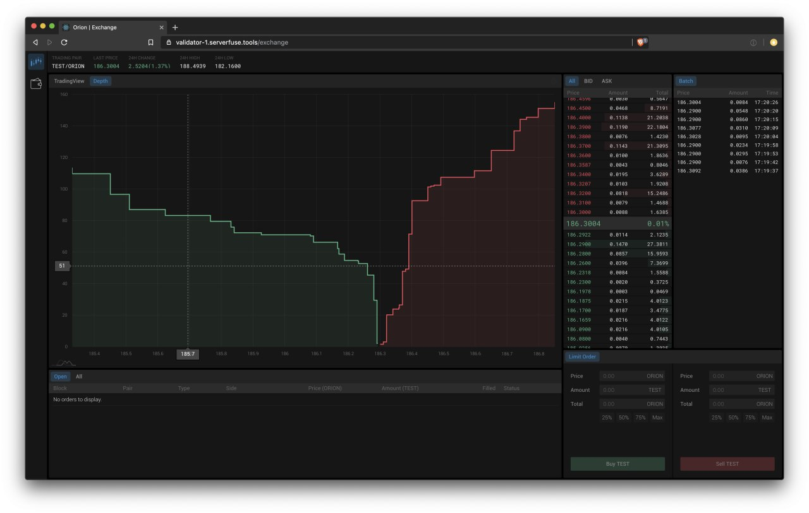
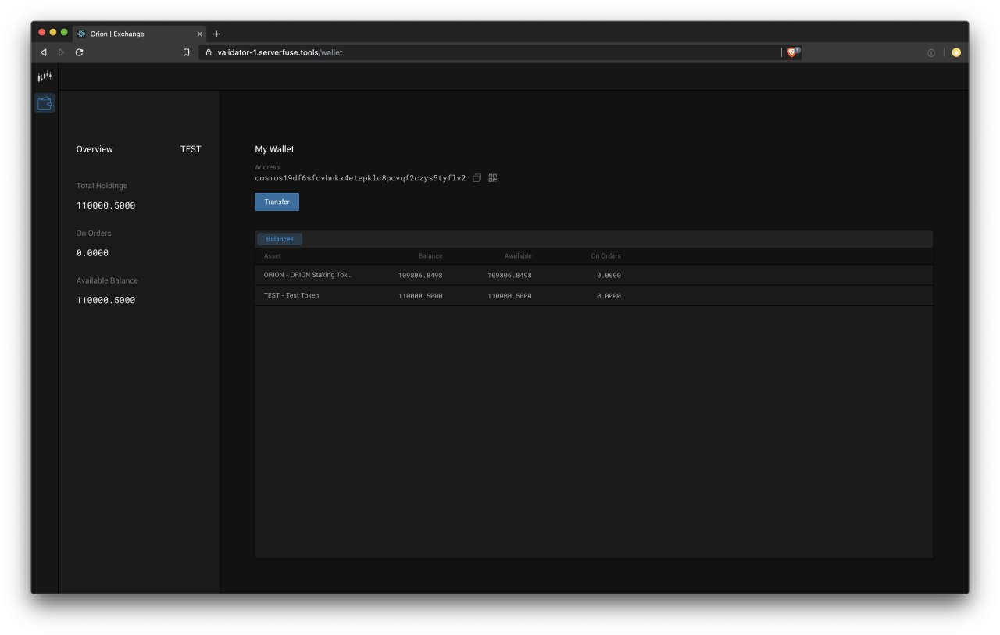

# IDC dex prototipe
# Disclaimer

The code hosted in this repository is a **technology preview** and is suitable for **demo purposes only**. The features provided by this draft implementation are not meant to be functionally complete and are not suitable for deployment in production.

**Use this software at your own risk**.

# IDCdex Demo


The goal of this demo is to explore, ideate, and create the next set of decentralized exchange (DEX) projects
that can be built on the Cosmos SDK. This platform intends to utilize certain DEX frameworks toward
creating a decentralized exchange network that utilizes various crypto primitives for the facilitation
of value transfers across systems.



## Getting The Code

The easiest way to get the code is to download one of our pre-built testnet release binaries
at https://github.com/tendermint/dex-demo/releases.

## Join the live testnet

To access our live testnet via a non-validating node, do the following:

1. Make sure to clean out your `.dexd` and `.dexcli` data directories.
2. Run `dexd init --chain-id=uex-testnet myvalidator` to initialize your node with the testnet's chain ID.
3. Copy the `genesis.json` file in the root of this repo to your `.dexd/config` directory. Make sure to overwrite the copy that was initially in there.
4. Set  the `seeds` in your `dexd` node's `config.toml` to the following value: `39d4d8b7b83e8eb2a38e352ea4a7f4e9268b3737@198.199.119.32:26656`.
5. Start your `dexd` node by running `dexd start`. Blocks should start to synchornize.
6. Create a key called `dex-demo` by running `dexcli keys add dex-demo`. Remember the password you create as it will be used to log in to the UI.
7. Run `dexcli rest-server --chain-id=uex-testnet --trust-node`.
8. Browse `http://localhost:1317/` to access the web interface.

Charts and graphs may look off until the chain is fully synced. You will be unable to post orders until synchronization is complete.

API docs are available at https://api.serverfuse.tools/

### Getting Coins



To get coins to play with on the live testnet, you'll need to use the faucet. To do so, follow these steps:

1. Click the wallet icon in the left sidebar. It looks like this: 
2. Copy the address that appears on screen.
3. Navigate to [faucet.serverfuse.tools](https://faucet.serverfuse.tools) in your web browser.
4. Paste in your address, choose a coin type, and click the Send button. Once your request is processed, you will receive some coins of the specified type.

## Setup a local testnet

To create a local testnet, do the following:

1. Compile and install the application.
2. Run the `make-genesis.sh` script in this directory. Part of this process will ask you to create a password - remember it, since it will be used to log in to the UI. This command will also create a genesis account, generate a genesis transaction, and validate the chain's initial genesis state.
3. Run `dexd start` to begin block creation.
4. In a separate terminal, run `dexcli rest-server`.

You now have a single-validator `dexd` chain and an attached REST server. You should now be able to play with the DEX at http://localhost:1317.

## Architecture

This DeX Demo is a standard Cosmos SDK application. It consists of three tools:

1. `dexd`, which runs the blockchain itself.
2. `dexcli`, which runs the REST server and acts as a CLI client for `dexd`.

## Build Instructions

The `Makefile` contains all necessary tasks to build the DeX Demo. No dependencies beyond `go` 1.13 or
above are necessary to build the `dexd` and `dexcli` tools out-of-the box. To build these, run
`make install`.

If you make some changes in the directory `ui`, you need to rebuild the web UI:

```
$ make update-ui
```

To update the UI you will need:

1. `packr`
2. Node.js v11 or above

## Running Tests

Unit tests can be run via `make test-unit`. Unit tests are marked as such via calls to `testflags.UnitTest` within the test functions themselves.

Integration tests can be run via `make test`. Note that this will build all tools prior to execution. Integration tests execute against the CLI. As such, they are somewhat resource-intensive and slow.

